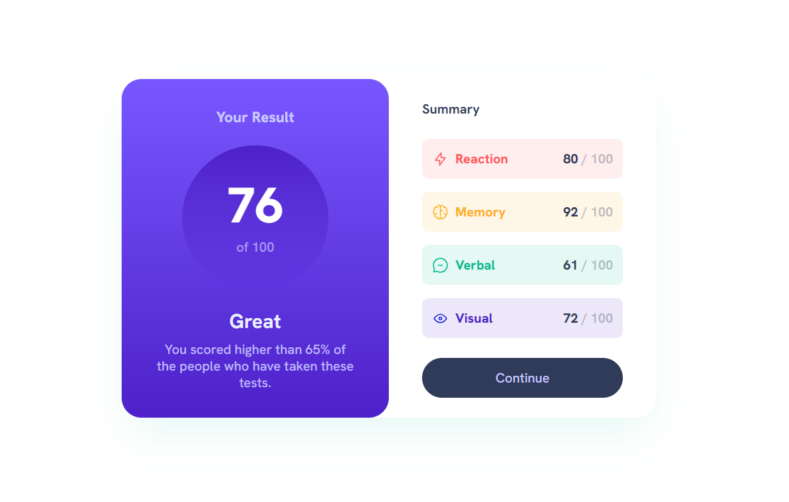
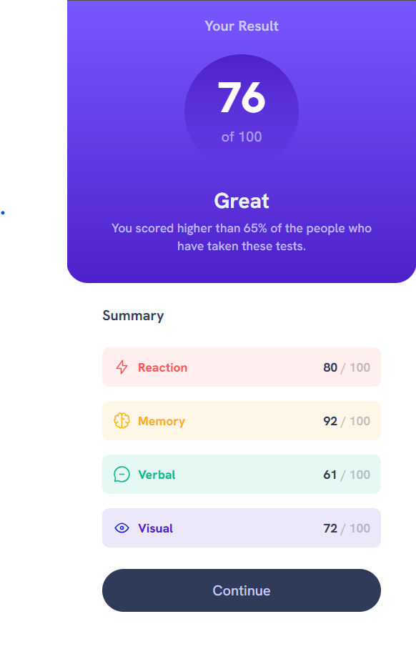

# Frontend Mentor - Results summary component solution

This is a solution to the [Results summary component challenge on Frontend Mentor](https://www.frontendmentor.io/challenges/results-summary-component-CE_K6s0maV). Frontend Mentor challenges help you improve your coding skills by building realistic projects. 

## Table of contents

- [Overview](#overview)
  - [The challenge](#the-challenge)
  - [Screenshot](#screenshot)
  - [Links](#links)
- [My process](#my-process)
  - [Built with](#built-with)
  - [What I learned](#what-i-learned)
- [Author](#author)

## Overview

### The challenge

Users should be able to:

- View the optimal layout for the interface depending on their device's screen size
- See hover and focus states for all interactive elements on the page

### Screenshot

### Links

- Solution URL: [https://www.frontendmentor.io/solutions/responsive-results-summary-component-using-html-vite-and-tailwindcss-0nxi64sYFN](https://www.frontendmentor.io/solutions/responsive-results-summary-component-using-html-vite-and-tailwindcss-0nxi64sYFN)
- Live Site URL: [https://results-summary-component-ndc.netlify.app/](https://results-summary-component-ndc.netlify.app/)

## My process

### Built with

- Semantic HTML5 markup
- TailwindCSS
- Flexbox
- Mobile-first workflow
- [Vite](https://vitejs.dev/) - Next generation frontend tooling

### What I learned

This was a simple project. The most important thing I learned is it's difficult to match a website to an image. This is why a Figma design is necessary, which points to the importance of a Frontend Mentor Pro subscription. With a design file you can extract the exact colors, spacing values and other variables used throughout the design. This ensures that the website closely matches the design.

## Author

- Frontend Mentor - [@chiroro-jr](https://www.frontendmentor.io/profile/chiroro-jr)
- Twitter - [@chiroro_jr](https://twitter.com/chiroro_jr)
